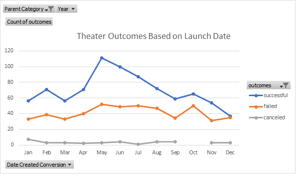

# Kickstarter-Analysis
Week 1 for Columbia's DA Bootcamp

# Kickstarting with Excel

## Overview of Project

**Purpose**
The purpose of this analysis was to put into practice key functions of Excel
which included, filtering and formatting the raw data given, creating pivot 
tables to analyze the statistics of the raw data, and to create visuals, pivot 
graphs, from pivot charts to express those results for our client named, Louise. 
And finally to familarize ourselves with GitHub, to commit our edits and upload 
our analyzed data into a repository.
	
**Background**
Excel is a must-have skill when it comes to data analysis. It is the basis for 
collecting data, analyzing it, and displaying it to an audience for easier digestion. 
Through this exercise, we were able to learn common functions such as Filters, 
Sorting, VLOOKUP, Pivot Charts & Graphs, and more to organize bulk data into 
meaningful inferences that can be applied practically to solve problems, answer questions. 
	
In this challenge, we were given the aim to help Louise find out how other play campaigns 
fared compared to their launch dates and funding goals using the Kickstarter dataset. 
The dataset contained information such as their fund goal amount, the 
success/fail/cancel/or live outcome of the kickstarter campaign, and the date of launch.
Using the provided raw data, we needed to extract information to then run statistics for
the counts of each outcome to answer Louise's inquiries. 
 
## Analysis and Challenges

**Analysis of Outcomes Based on Launch Date**
Firstly, we extracted the date from the **UNIX timestamps** using the following formula 
below, then the year from the date using excel's year function: **year(cell)**. 


To answer Louise's first queston of what the theater outcomes were based on the launch 
date, we created a **pivot chart** from the kickstarter worksheet that was able to filter
by parent category (theater) and year, list the months as rows, and show the outcomes in
columns. The pivot table showed counts for each month of the number of successes, fails,
canceled theater campaigns, and those that were live (still active). We selected only the
successes, fails, and canceled campaigns because there was no significance to view live
campaigns since it was not applicable to Louise's question.
		
		

Filtering based on the "parent category" for "theater" and sorting the campaign outcomes
in decending order, we see that successful, failed, and cancel are in the order we want.
Using the pivot chart, we then created a pivot line graph comparing the outcomes of each
play campaign to its launch date. 



The first deliverable is then completed

**Analysis of Outcomes Based on Goals**
Secondly, we compared the campaign outcomes to the goal fund amounts. This required us
to create a visual that displayed the percentage of successful, failed, or canceled plays.
By using the countifs() function, we were able to count the number of each outcome based 
on their goal fund ranges.


After inputing the function along with its conditions into excel, the resulting data table
was created.


Then, we generated a line graph showing the trend of outcomes compared to goal funds.


Deliverable 2 is completed.

**Challenges and Difficulties Encountered**

Some challenges and difficulties faced included implementing the right formulas for Excel
and familarizing myself with how to upload, commit, and use the proper syntax to edit the readme.md 
file on GitHub. For example, when utilizing the countifs() function on excel, the first difficulty 
is grasping how the function is extracting the wanted data from the raw dataset. In this case, I 
came to understand that excel looks through a column range and begins comparing it's values to my
set condition; whether that is a logical statement or a string. I can add as many conditionals to
filter the data and have excel count the number of times within my raw dataset matches my conditionals.
I learned that I can have this function repeated for each goal range and also calculate the percentages
of each outcome count by dividing one of the outcome counts (successful/failed/orcanceled) over the 
sum() of the total projects counted and changing the cell formatting to percentage. Once the excel sheet
Kickstarter_Analysis was completed, the following instructions were used to create a repository.
https://courses.bootcampspot.com/courses/949/pages/1-dot-6-1-using-github?module_item_id=339501
I then researched the different ways to upload my files into my GitHub repository. I decided on 
first cloning my repository onto my computer. To do this, I copied the url from GitHub for my repo,
then I right clicked in the directory that I wanted my repo saved on my computer and clicked 
gitbash from the drop-down menu. This opened the gitbash command prompt where I typed in the 
following code:
```
	limag@DESKTOP-879DHH1 MINGW64 ~/Desktop/VC_1&2_Excel/Module 1
	$ git clone https://github.com/limaggieling/Kickstarter-Analysis.git
	Cloning into 'Kickstarter-Analysis'...
	remote: Enumerating objects: 3, done.
	remote: Counting objects: 100% (3/3), done.
	remote: Compressing objects: 100% (2/2), done.
	remote: Total 3 (delta 0), reused 0 (delta 0), pack-reused 0
	Receiving objects: 100% (3/3), done.
```
and pasting the url of my repo. This successfully cloned my repo to my local computer and then 
I proceeded to use the GitHub desktop application to save my commits. Everytime I made an edit, 
it would show up on my GitHub desktop application under changes on the left hand side of the window.
From there, I detailed what the edit was and press **commit to main**. My final challenge was in the
third deliverable of editing the readme.md file on Github. I initially began editing the readme.md 
file on my computerthrough Notepad++, but in this regard I was unable to preview my prose and code. 
At the peak of my frustration, I realized I was able to edit on GitHub.com. From there, I could easily
type and test out my formatting with the preview tab. The resource link: 

https://docs.github.com/en/github/writing-on-github/getting-started-with-writing-and-formatting-on-github/basic-writing-and-formatting-syntax#styling-text

was useful in guiding me through the syntax necessary to format my prose and code. I learned while
typing that my keyboard shortcuts such as ctrl+B automatically added the proper syntax for bolding. I
also realized that using tabs produced a simialr outcome to using backticks for quoting code. Another 
challenge was adding images to my readme file. Initially, I was perplexed at why my images were not 
showing up dispite me following the code provided as such:
```

```
I realized, I was using the path url of my computer instead of my repo which caused a 404 error.
Once I used the url provided from my repo of my images, it was
smooth sailing from there. Many of the difficulties I faced were simply fixed with trial and error. 
It was exciting to test out code and check if my result was true to my expectation. I continue to 
look forward to acquiring more knowledge of syntax in the coming lessons.

## Results

- What are two conclusions you can draw about the Outcomes based on Launch Date?
1) Launch dates in the months of May and June were most successful.
2) On average, there were about 40 failed plays no matter the launch date.

- What can you conclude about the Outcomes based on Goals?
The most successful goal fund ranges were anywhere less than $1,000 to $4,999 and $35,000 to $44,999 in their respective currency units.

- What are some limitations of this dataset?
The dataset may be limited in its insight on the demographic of individuals who made the largest donations to a genre of play. 
By obtaining such information, we may be able to provide Louise conclusions on whom could be her target
audience depending on the genre of play she hopes to showcase in the future. With that knowledge, she could tailor her marketing 
plan for a more successful kickstarter campaign.

- What are some other possible tables and/or graphs that we could create?
We could include a column for play genre and then include a pivot table that has the number of backers for each outcome filtered by the play genre. A line graph could then be used to see a trend of which genres had the most backers.
